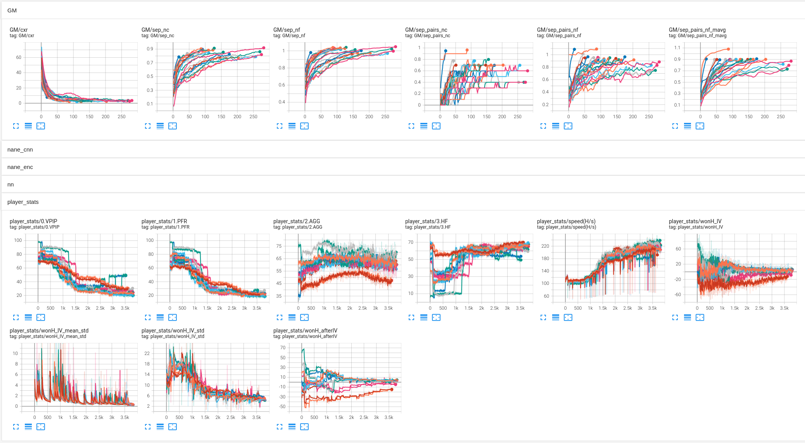
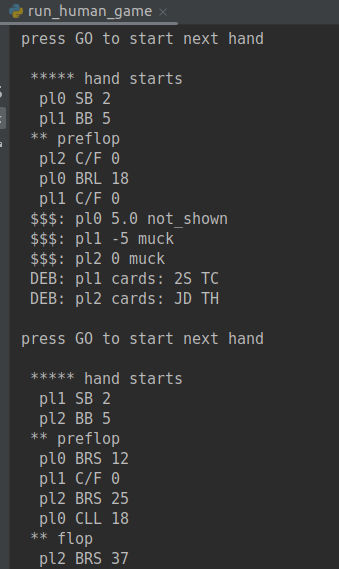

<!--SKIP_FIX-->


## Deep Reinforcement Learning (DRL) with Neural Network (NN) based Agent in NL Texas Hold'em Poker Game Environment with Python & PyTorch

It is a pure DRL with implemented algorithms such as PG, AC and PPO.<br>
pypoks does not use any search algorithm while training or playing.<br>
No prior knowledge of poker game rules is required by the RL algorithm.<br>
The algorithm can be easily adjusted for any bet sizes, table sizes, starting stacks, etc.

### Research Scope of the Project (ML/RL):
- Testbed for different RL concepts like PG, A3C, PPO, and their modifications
- Efficient NN Agent (PyTorch-based) architecture details
- Asynchronous self-play: multi-GPU, many subprocesses, hundreds of tables at once
- Efficient environment events (data) representation (multiplayer, many bets)
- Efficient process (and subprocesses) monitoring
- Genetic Algorithms (GA) for policies (with PyTorch)
- High (poker) variance & backpropagation
- High (poker) variance & policy evaluation

### How to Read the Docs

In some sub-folders, there are separate READMEs (.md). Please follow them for more detailed concepts
of the code from the sub-folders. 

---
### Setup

The project may be set up with Python=<3.11. Install requirements from `requirements.txt`<br>
For instructions on how to install `tkinter` for Python 3.11, please go to the gui/tkinter folder.

### Training

To run training scripts, you will need about 50 CPU cores, 120GB RAM, and a 2x GPU system.<br>
You may just play `run_human_game.py` with trained agents downloaded from [here](https://drive.google.com/file/d/1e4QEdch2SVgloQjSNzftAohn_Y_lji-U/view?usp=sharing)
To play a human game with agents, you will also need `tkinter` for GUI. Please install it.

To train a poker agent **(DMK)** from scratch, run:

```
$ python run/run_train_loop.py
```

This script will train a set of agents with RL self-play. The script is preconfigured with many options that will fit a system with 2x GPUs (11GB).
Trained agents available for download with the link above took about 5 days to train.<br>

While training, you may check the progress with TensorBoard (run `run_TB.sh`)



In case of `OSError: [Errno 24] Too many open files`, you may need to increase the open-files limit: `$ ulimit -n 65535`

### Human Game - Playing with Trained Agents

To play a game with trained agents:
```
$ python run/run_human_game.py
```


Allowed moves are defined in the ```/game_configs``` yaml file.

While playing, a debug of the game is logged to the terminal - you can always check the cards played by each agent.

