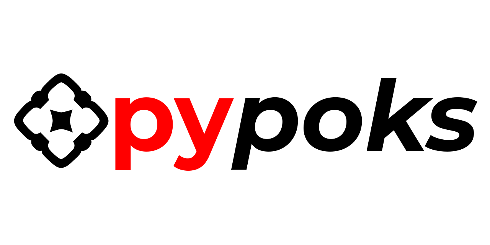

Reinforcement Learning(RL) with neural network(NN) agent @poker game environment with Python & TensorFlow(TF)

Machine Learining(ML) areas to cover:
- RL + NN to make good decisions (building the strategy)
- limited and noisy input (observation data)
- efficient environment (data) representation for NN & RL 
- backpropagation & high poker variance
- genetic algorithms (GA) implementation  

Technology:
- advanced neural networks architectures @TensorFlow
- data extraction & processing with Python
- Python Multiprocessing & TF (many processes, many GPUs and a lot of data for parallel computing)
- GA with TF

if you are interested in collaboration please email [me](mailto:tojestprzedmalpa@gmail.com)

#
setup:

Create virtualenv with python 3.6
```
$ virtualenv -p python3.6 venv
```
Activate it
```
$ source venv/bin/activate
```
Install requirements
```
$ pip install -r requirements.txt
```
Install spacy en model
```
$ python -m spacy download en
```