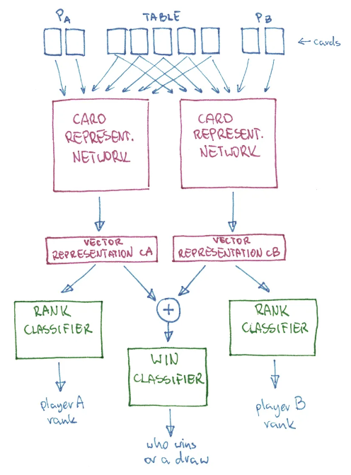
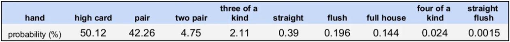

## cardNet

**cardNet** (CN) is a Transformer (TNS) based Neural Network responsible for representing and evaluating poker hands.
CN encodes 7 given cards (2 player and 5 table cards) into a single tensor.
This tensor stores all the information about the cards, their strength, rank, and other valuable properties.
Cards are represented with embeddings. Embeddings are learned while training the NN.

There are used two predefined cardNet versions used in the project that differs in used card embedding size: 
- CN12 (card embedding width: 12) is an 8-layer TNS encoder to an 84 width tensor.
- CN24 (card embedding width: 24) is an 8-layer TNS encoder to a 168 width tensor.

CN is trained in a supervised scheme. Data for training is generated with Monte Carlo simulation.
Pretrained CN is used by the DMK NN module while training Agents with a Reinforcement Learning (RL) algorithm,
where carndNet may be further fine-tuned or fixed (locked weights).
There is also an option to start RL without pretrained cardNet, weight of cardNet wil be trained from scratch
using reinforce signal, but it will take longer.

### Training

To pretrain **cardNet**, run:

```
$ python podecide/cardNet/cardNet_train.py
```
The training of cardNet uses a single GPU and will take about 2 hours on a single GTX1080.

---
### Why Transformer?

7 cards are treated as a sequence, in details a sequence of sets.
There are two sets
- 2 player cards
- 5 table cards

2 player cards are always known and their order is not important (set). Next 5 cards are table cards and those also
make a set - order is not important. Among those cards some (or all) may be unknown. cardNet is able to encode
and evaluate also incomplete hands. Unknown cards are padded then.

There is one important detail of implementation. As I wrote it is a sequence of sets. Why?
Because we cannot mix player hands with table cards to properly evaluate strength of a hand.
To incorporate that information positional embeddings are used. Only two positions are needed: player and table.

Transformer is a network designed for sequences.
I have done some experiments with other network architectures like convolutional but Transformer worked best.

Cards could be also encoded with dense feedforward architecture. Such concept has one big drawback:
For feedforward network AK an KA would result in two different inputs.
This issue would complicate data preparation and training procedure.

### Training setup details

Training environment is outlined below:



cardNet is duplicated into two copies (shared weights).
Two cardNets encode two players cards with shared table cards. You can think about it as a heads-up setup.
cardNet task is to prepare representation vector.
Additional classifiers are used to generate loss gradients generated in rank and winner tasks.

### Monte Carlo simulation

Monte Carlo (MC) simulation is used to generate approximations of hands strengths used as a supervised knowledge.
Imagine player holds AA, what is the strength of this hand? In heads-up game it is about 85%
(against random 100 opponent hands he will win 85 times). MC simulation is used to approximate this value.
The deeper simulation the more accurate the approximation is. 
Test set is built of 2000 hands. Each hand strength is approximated with 10M MC samples.
Train samples may be built or generated live. 100 MC samples are used to build each train hand example.

To speed up training and make cardNet more familiar with rare ranks additional balancing of ranks has been implemented.

