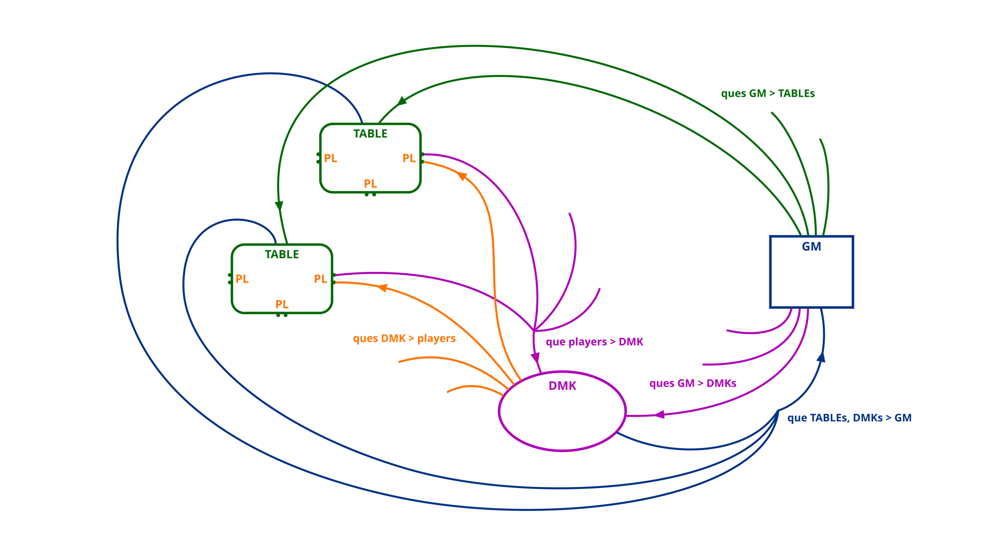

<!--SKIP_FIX-->
## podecide - Poker Decisions

`podecide` folder contains code responsible for making poker decisions using policies. The main objects are:

- **DMK** - Decision Maker, the top layer of abstraction responsible for learning and making decisions
- **DMK Module** - PyTorch definition of NN used for learning / storing / and running policy
- **StatsManager** - (SM) a component that provides statistics to support DMK during learning and decision-making
- **GameManager** - (GM) manages many DMKs while playing poker game on multiple tables

---

### DMK - Decision MaKer

The Decision MaKer (DMK) - the Agent - defines the basic interface for making decisions for poker players (PPlayer on PTable).
A single DMK handles one policy and makes decisions for multiple players (n_players).

An Agent is based on NN built of 2 main parts:
- **cardNet** - a Transformer-based NN part responsible for preparation of card representations.
- agent network - Causal version of Temporal Convolution-based NN part responsible for encoding sequence of states data.

Decisions are made using the **Many States One Decision** (MSOD) concept.
**MSOD** assumes that a table player can send multiple (1-N) states to DMK before asking DMK for a move decision.
DMK computes policy move probabilities for all sent states, even for those
that do not require table decisions from a player (while training those decisions got 0 loss).

The two main functions of DMK are:
- collecting data from poker players (instances on the tables)
- making decisions (moves) for the players

##### Collecting Data
DMK receives data (Hand History) from a table player. The player sends a list of states (calling: `DMK.collect_states`)
either before making a move or after a hand. Occasionally, the player sends a list of possible_moves
(calling: `DMK.collect_possible_moves`). Possible_moves are added by DMK to the last sent state.
After sending possible moves, the player/table must wait for DMK's decision:
- no new states from the table (for that player) will be received until a decision is made
- table with the waiting player is locked at this point

##### Making Decisions
DMK usually makes decisions (moves) for many poker table players sitting at different tables.
A move is made with the Agent policy based on the given data:
- received states (saved in `_states_new`)
- possible moves sent by the player
- any previous history stored by DMK

DMK decides WHEN to make decisions (`DMK.make_decisions()`). DMK makes decisions for (one-some-all) players
with allowed_moves saved in `_states_new`. States used to make decisions are moved (appended)
to `_states_dec`, from where they are used to update DMK’s policy during training.

### PPO implementation
pypoks implements PPO in a modified / simplified version:
- GAE is not used
- Value Function and Advantage are not used / implemented, reward is used as a reinforce signal

PPO implementation is split among few scripts. `DMK_Motorch` (`dmk_motorch.py`) implements (overrides MOTorch) `backward()`
with update ovre mini-batches. `ProCNN_DMK_PPO` module (`dmk_module.py`) implements PPO loss with all the details.