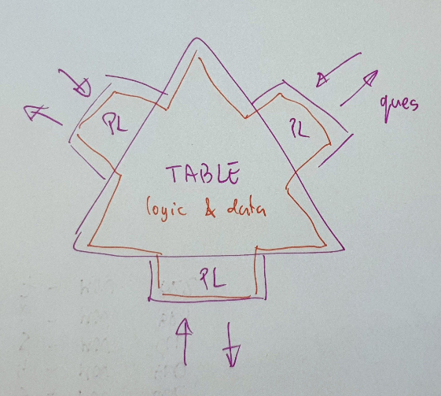

<!--SKIP_FIX-->
## pologic - poker logic of Table & (table) Player

Pologic - logic of the poker game.
Here are defined key components such as **Table**, **Player**, **Hand History**, and **Card Deck**.
---

### Table & Player

The Table has players and runs a poker game.
The Table is initiated with a list of Player IDs.



##### Running a Hand:

The initial order of Players, provided during the Table initialization,
determines the sequence for the first hand played.
For every following hand, the players are rotated.

The Table builds a **Hand History** (HH) with events during the game.
Periodically, each Player is asked to make a move - a decision based on probabilities.
A Player may (or should) utilize the data from HH.

##### QPTable & QPPlayer:

QPTable is a table that uses QPPlayer instead of PPlayer.
QPTable is a Process, and QPPlayer utilizes queues to communicate
with the decision-making object: DMK - Decision MaKer.
---

### podeck - poker Cards Deck

Cards may be represented in three types:
- int 0-52, where 52 represents a 'pad' (an unknown card)
- tuple (int,int) (0-13,0-3) (pad is (13,0))
- str ‘9C’, figures: 2..9TJDKAX; suits: SHDC (pad is XS)

Each representation has its advantages:
- integers are simple
- tuples are used for efficient card rank computation
- strings are easy to read and somewhat standard for poker notation
---

### Hand History

Hand History (HH) is a list of events that occurred during a single poker hand run.
The primary purpose of HH in pypoks is to furnish all necessary information for DMK to make decisions.
HH is built by the table while playing a hand, and it may contain some redundant information.

HH has events which are ```List[STATE]```, where ```STATE = Tuple[str,Tuple]```.
HH can be saved as a jsonl.

Below is an example of an HH:

    ["GCF", ["2players_2bets"]]
    ["HST", ["table", 0]]
    ["TST", [0]]
    ["T$$", [0, 0, 0, 0]]
    ["POS", ["human", 0, 1000]]
    ["POS", ["dmk001a09", 1, 1000]]
    ["PSB", ["human", 5]]
    ["PBB", ["dmk001a09", 10]]
    ["T$$", [15, 15, 10, 10]]
    ["PLH", ["dmk001a09", "8H", "JS"]]
    ["PLH", ["human", "JD", "TS"]]
    ["TST", [1]]
    ["MOV", ["human", 3, 20, [0.0, 0.0, 0.0, 1.0, 0.0], [995, 5, 5]]]

Below is a detailed description of all possible ```STATES```:

    GCF: (game_config_name:str,)                                                                    name of the game config
    HST: (table_name:str, hand_id:int)                                                              hand starts
    TST: (table_state:int,)                                                                         one from envy.TBL_STT
    POS: (pl_id:str, pos:int, pl.cash)                                                              player position and starting cash
    PSB: (pl_id:str, SB$:int)                                                                       player puts SB
    PBB: (pl_id:str, BB$:int)                                                                       player puts BB
    T$$: (pot:int, cash_cs:int, cash_tc:int, cash_rs:int)                                           table cash, for every table cash change (street, MOV ..PSB+PBB <- together)
    PLH: (pl_id:str, ca:str, cb:str)                                                                player hand
    TCD: (c0,c1,c2..:str)                                                                           table cards dealt, only new cards are shown
    MOV: (pl_id:str, mv:int, mv_cash:int, mv_probs:List[float], (pl.cash, pl.cash_ch, pl.cash_cs))  player move (pl.cashes BEFORE move)
    PRS: (pl_id:str, won:int, full_rank)                                                            player result (full_rank is a tuple returned by PDeck.cards_rank)
    HFN: (table_name:str, hand_id:int)                                                              hand finished

Below is listed the possible order of ```STATES```:
    
    GCF
    HST                             <- hand starts
    TST(0)                          <- idle
    T$$
    POS,POS,..
    PSB,PBB
    T$$
    PLH,PLH,..
    TST(1)                          <- preflop
        loop of MOV, T$$
    TST(2)                          <- flop
    T$$
    TCD
        loop of MOV, T$$
        next streets like flop
    TST(5)                          <- showdown [optional]
    PRS,PRS,..
    HFN                             <- hand finished

##### HHtexts

HH may be converted (reduced) to HHtexts. 
HHtexts is a human friendly text format representation of HH.
HHtexts still retains all the information needed to replay the hand.
HHtexts may be used to replay the hand or evaluate an agent policy.
HHtexts are built with a selection of HH ```STATES```, below is the syntax:

    HH STATE  HHtexts syntax                          : desc                                
    --------------------------------------------------------
    GCF       GCF: <game_config_name>                 : game config name, one from pologic.game_config.GAME_CONFIG_NAMES
    POS       POS: <player_name> <pos> <$>            : player name, position and stack
    PSB       <player_name> SB <SB $>                 : small blind
    PBB       <player_name> BB <BB $>                 : big blind
    T$$       table POT: <POT $>                      : actual table POT size
    PLH       PLH: <player_name> <card1> <card2>      : player cards
    TST       ** <table_state_name>                   : table state, one from: preflop, flop, turn, river, showdown
    TCD       TCD: <card3> <card4> <card5>            : table cards dealt, three or one
    MOV       MOV: <player_name> <mov_name> <$>       : player made a move: player name, move name, move size
    PRS       result: <player_name> <$> <cards rank>  : player result, cards_rank comes from pologic.podeck.HND_RNK or not_shown, muck

While replaying the hand with HHtexts, the table validates the given data for consistency.
Only lines starting with ```GCF, POS, PLH, TCD, MOV``` are truly required
to properly replay the hand, and only those are checked.
Other lines are optional, added for better readability, and are not validated by the table.

The break pattern: ```MOV: ??``` may be used to break the hand after a player move.
Below is an example of a hand (line numbers in brackets are not saved with HHtexts)
with the proper order of states:

    (01)    GCF: 2players_2bets
    (02)    table POT: 0
    (03)    POS: agent BTN 1000
    (04)    POS: human BB 1000
    (05)    agent SB 5
    (06)    human BB 10
    (07)    table POT: 15
    (08)    PLH: human JD 6D
    (09)    PLH: agent KH TC
    (10)    ** preflop
    (11)    MOV: agent BR6 37
    (12)    table POT: 52
    (13)    MOV: human CLL 32
    (14)    table POT: 84
    (15)    ** flop
    (16)    table POT: 84
    (17)    TCD: DS 8D 3H
    (18)    MOV: human CCK 0
    (19)    table POT: 84
    (20)    MOV: ??

additional notes:
- the actual table POT size is added in the second line (02), after blinds (07), after each MOV (11,13,19), at the beginning of each river (16)
- if the break pattern is not added at the end (20) the game would continue by the table till the end of a hand